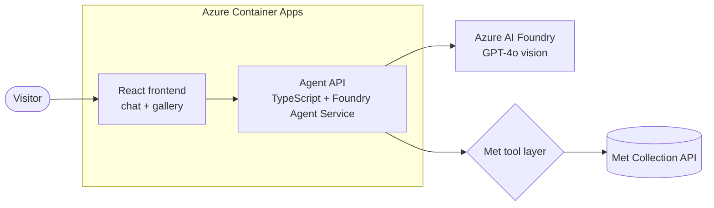
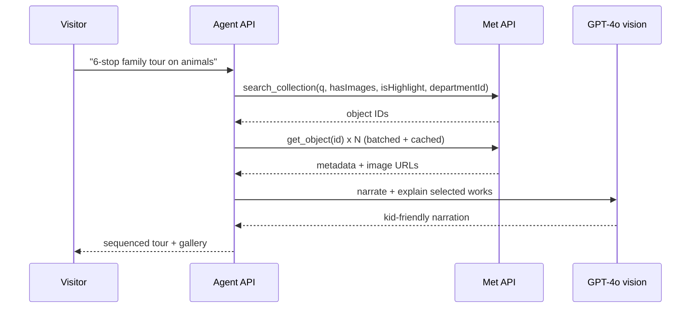

## Overview and Architecture

This page frames the scenario, explains why the Met Collection API is the ideal
showcase data, and describes the target architecture you will build across the
seven steps.

### The scenario

**The Visitor's Agentic Sidekick** is a conversational, multimodal agent that
turns the Met's open-access collection into curated, narrated experiences:
themed self-guided tours, cross-cultural connections, and kid-friendly
explanations. Every response is grounded live in the Met API through agentic
tool-calling, not baked into a static dataset.

The visitor-facing story leads because it demos well on stage. Underneath sits
the enterprise hook: the same capability lets a curator or educator assemble
collections and draft exhibit labels in minutes. That dual value, a delightful
consumer experience backed by a real productivity tool, is what makes the
pattern compelling to partners.

### Why the Met Collection API is the ideal showcase data

The Met API removes almost every source of demo friction.

| Property | Why it matters for the demo |
| --------------------------------- | ------------------------------------------------------------ |
| No API key required | Works live on stage with zero credential setup |
| CC0 public domain content | Safe to display; no licensing or content-safety surprises |
| High-resolution images | Shows off Foundry GPT-4o vision on real artwork |
| Rich structured metadata | Department, culture, period, medium, tags map cleanly to tool parameters |
| Strong search filters | Enables multi-step agentic retrieval, not just single-shot Q&A |
| 470,000+ objects | Deep enough to make every tour feel unique |

Because the data is already clean, structured, and openly licensed, you spend
zero time on data preparation and all your time on the agent. Rate limits are
generous at 80 requests per second.

### The signature "aha" moments

Each moment proves that an agent with tools beats autocomplete.

1. **Multi-step tour from one sentence.** *"Build a 6-stop family tour on animals
   in art across cultures"* triggers searches across multiple departments,
   filters to works with images and highlights, sequences the stops, writes
   narration, and renders a gallery.
2. **Multimodal explanation.** *"Explain this painting to a 10-year-old"* runs
   GPT-4o vision over the object's image.
3. **Cross-cultural connections.** *"How did different cultures depict cats?"*
   uses the tag and culture fields to find related works.
4. **A live feature via the Coding Agent.** Ask the GitHub Coding Agent to add a
   `find_related_works` tool and review its pull request while the room watches.

### Target architecture

The running system is two containers plus a Foundry project, all provisioned as
code.

The request flow for a tour request looks like this.

### The one guardrail worth staging

The Met `/search` endpoint returns only object IDs, so you must fan out to
`/objects/{id}` to get metadata and images. That is a classic N+1 problem, and
it is the perfect moment to have Copilot write a **batched and cached** fetch
live on stage. It demonstrates agentic problem-solving, not just code
generation. Always filter `hasImages=true` and check `isPublicDomain` so every
rendered result is safe and displayable.

### What the layers map to

You will assemble the system from CAIRA reference components rather than writing
infrastructure from scratch.

| System layer | CAIRA component | Role |
| ------------------- | -------------------------------------------------- | ------------------------------------------- |
| Foundry + models | `reference-architectures/iac/foundry/` | Foundry account, project, GPT-4o deployment |
| Hosting | `reference-architectures/iac/container-apps/` | Two Container Apps: API and frontend |
| Agent API | `reference-architectures/app/api/typescript/foundry-agent-service/` | TypeScript Foundry Agent Service |
| Frontend | `reference-architectures/app/frontend/typescript/react/` | Chat, gallery grid, tour view |

### Next

Continue to [Prerequisites and setup](02-prerequisites.md) to install the tools
and configure your environment.
