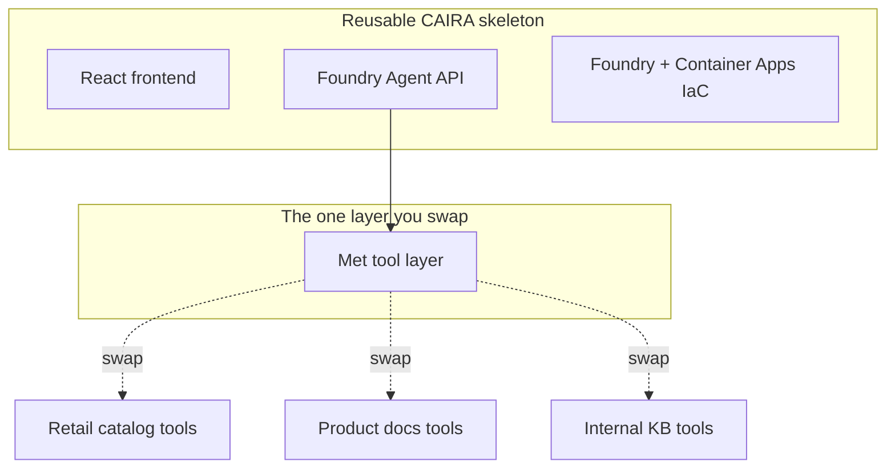

## CAIRA as a Golden Accelerator

The Museum Sidekick is a demo, but the pattern under it is a reusable accelerator.
This page shows how CAIRA components map to the system and how partners retarget
the same skeleton to their own domain by swapping one layer.

### The component mapping

Almost everything except the Met tool layer came from CAIRA. That is the point:
partners spend their time on domain logic, not on infrastructure and scaffolding.

| System layer | CAIRA component | What you customized |
| ------------------ | -------------------------------------------------------------------- | -------------------------------------------- |
| Foundry + models | `reference-architectures/iac/foundry/` | Model set to GPT-4o with vision |
| Hosting | `reference-architectures/iac/container-apps/` | Two apps: api and frontend |
| Agent API | `reference-architectures/app/api/typescript/foundry-agent-service/` | Agent instructions and tool registration |
| Frontend | `reference-architectures/app/frontend/typescript/react/` | Chat, gallery grid, and tour view |
| Retrieval | none (you built it) | The Met tool layer |

### The one layer that changes

The Met tool layer is the only domain-specific code in the whole system.
Everything else is reusable. To retarget the accelerator, you swap that layer for
tools over a different data source.

### What partners plug in

The same skeleton becomes a different product depending on the tools you attach.

| Partner domain | Data source behind the tools | Example capability |
| ------------------- | ---------------------------------- | ------------------------------------------ |
| Retail | Product catalog API | "Build me a capsule wardrobe under a budget" |
| Software vendor | Product documentation | "Walk me through setting up feature X" |
| Enterprise IT | Internal knowledge base | "Assemble an onboarding path for a new hire" |
| Field services | Equipment and manuals API | "Diagnose this part from a photo" |

Each of these reuses the Foundry agent, the Container Apps hosting, the React
shell, the tests-and-self-heal loop, and the deploy flow unchanged. Only the tool
layer and the agent's instructions change.

### Why this matters for the HVE story

The walkthrough proves two things at once.

* HVE's research-first RPI loop keeps every step grounded and verifiable, so the
  generated code is trustworthy rather than plausible.
* CAIRA supplies validated infrastructure and app scaffolding, so the effort goes
  into the differentiating layer, not the boilerplate.

Together they turn "build an agentic app" from a weeks-long project into a guided,
repeatable path a partner can follow with their own data on day one.

### Next

See the [Met API and agent tools reference](11-met-api-reference.md) for the
endpoint and tool details used throughout the build.
