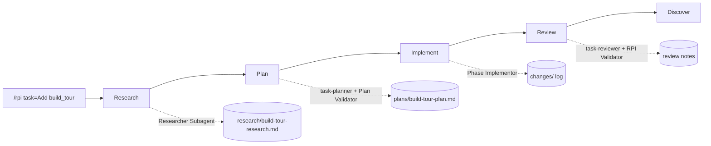

## Build Approaches: Baseline vs True HVE-Core RPI

The seven-step walkthrough shows the *methodology*. This page is about *execution
mode*: the different ways you can actually drive that methodology with Copilot,
how the current POC was built, what a fully HVE-Core-driven build looks like, and
how to choose between them. Read this when you want to understand the trade-offs
before you start your own build.

### Three ways to run the same loop

Research → Plan → Implement → Review is the constant. What changes is who holds
the pen and where the audit trail lives.

| Approach | Who drives the loop | Where the artifacts live | Best for |
| ------------------------- | -------------------------------------------- | ------------------------------------------ | ------------------------------------------------ |
| Manual / ad hoc | You, prompt by prompt, no fixed structure | Nowhere durable (chat history only) | Throwaway spikes, tiny one-file changes |
| Hybrid (methodology only) | You, following the RPI shape by hand | Hand-authored files under tracking folders | Learning the loop, tight control, mixed codebases |
| True HVE-Core RPI | The `/rpi` agent and its subagents | Auto-generated under `.copilot-tracking/`  | Repeatable, auditable, team-scale feature work |

The distinction that matters most for this repository is between the second and
third rows. Both produce the same kinds of artifacts. Only the third one is
actually driven by the HVE-Core prompts and agents.

### How the baseline POC was built (hybrid)

The working proof-of-concept in [`museum-sidekick/`](../museum-sidekick/) was
built with the **hybrid** approach. The RPI *shape* was followed deliberately:
the Met tool layer went through research, then a plan, then implementation, and
the corresponding documents were written into
`museum-sidekick/.copilot-tracking/`. That structure is real and useful.

What it did **not** do is invoke the real HVE-Core `/rpi` prompt or its
subagents. The tracking documents were authored by hand while following the
methodology, rather than emitted by the `RPI Agent`, the `Researcher Subagent`,
the `task-planner`, and the reviewers. In other words, the baseline demonstrates
the *thinking* of HVE without yet demonstrating the *tooling*.

The baseline also made several deliberate, cost-conscious choices that diverge
from the tutorial text. Treat these as the source of truth for the POC.

| Topic | Tutorial says | The POC does | Why |
| --------------- | ------------------------- | ------------------------------------------------------------ | --------------------------------- |
| Project folder | `agentic-sidekick` | `museum-sidekick` | Clearer product name |
| Agent runtime | Foundry Agent Service SDK | Azure OpenAI GPT-4o via chat-completions with tool-calling | Cheaper, no server-side state, fully unit-testable |
| Auth | not specified | Passwordless-first with `DefaultAzureCredential`, key fallback | No secrets in the app |
| Hosting | Azure Container Apps | Container Apps with scale-to-zero, Basic-tier ACR | No compute cost when idle |
| IaC | CAIRA Terraform | Hand-written low-cost Terraform, grounded in CAIRA | Kept minimal for a POC |

This is a legitimate and common way to work. It is fast, it keeps you in full
control, and the artifacts still document intent. Its limitation is fidelity:
because a person authored the tracking files, they prove *what you intended*, not
*what an agent verified*.

### What a true HVE-Core build looks like (build_tour)

To demonstrate the third approach without rebuilding the whole POC, the next
increment drives a single new feature end-to-end through the real HVE-Core
workflow. The chosen feature is **`build_tour`**: a new agent tool that takes a
theme and returns an ordered, narrated sequence of public-domain artworks,
exposed alongside the existing `search_collection`, `get_object`,
`list_departments`, and `find_related` tools.

The full proposal lives in the untitled `plan-trueHveCoreBuild.prompt.md` draft.
The essence is that every phase is executed by an HVE-Core agent and leaves an
artifact behind as the audit trail.

| Phase | HVE-Core agent | Artifact under `.copilot-tracking/` |
| ---------- | ------------------------------------------ | ---------------------------------------- |
| Research | `Researcher Subagent` | `research/build-tour-research.md` |
| Plan | `task-planner`, then `Plan Validator` | `plans/build-tour-plan.md` |
| Implement | `Phase Implementor` | `changes/` change log |
| Review | `task-reviewer`, `RPI Validator` | review findings with severity grades |
| Discover | `RPI Agent` | suggested follow-up work items |

The point is not that the code is better. The point is that the artifacts are
**generated and validated by agents**, so they prove the work was grounded in
research and checked against the plan. That is the difference between "we
followed a good process" and "the process is verifiable."

### When to use which

Match the approach to the stakes and the audience, not to habit.

| If you need to... | Use | Because |
| ---------------------------------------------- | ------------------------- | ---------------------------------------------------- |
| Try an idea in one file and throw it away | Manual / ad hoc | Structure would only slow you down |
| Learn the RPI loop or keep tight manual control | Hybrid (methodology only) | You see every step and decide each move |
| Ship a feature others will review and maintain | True HVE-Core RPI | Auto-generated, validated artifacts are the audit trail |
| Prove grounding to a partner or stakeholder | True HVE-Core RPI | The tracking files show research and validation, not assertion |
| Delegate a whole feature and review a PR | Coding Agent (Step 6) | The agent works asynchronously and opens a PR |

A practical pattern is to combine them: use the hybrid approach to scaffold and
explore quickly, then switch to a true HVE-Core RPI run for the feature you want
to be auditable, as this repository does with `build_tour`.

### How to tell them apart in a repository

You can audit which approach produced a change by looking at the tracking folder.

* Hybrid artifacts are written in a human voice and tend to appear in a single
  commit alongside the code.
* True HVE-Core artifacts follow the phase templates emitted by the agents, carry
  the research-to-plan-to-changes chain, and include validator findings.

Both belong under `.copilot-tracking/`. The presence of validator output and a
phase-by-phase change log is the clearest signal that an actual `/rpi` run
produced the work.

### Next

* Revisit [Hand a feature to the Coding Agent](08-step-6-coding-agent.md) for the
  asynchronous delegation approach.
* See [CAIRA as a golden accelerator](10-caira-golden-accelerator.md) for how the
  reusable skeleton keeps the effort on the differentiating layer.
